# Event System Dataset: Documentation and Statistical Analysis

## 1. Overview

This document provides a formal description of the **Event System** dataset, a curated collection of Kubernetes failure scenarios designed for training and evaluating AI-driven root cause analysis (RCA) agents. The dataset was derived from the ROMA platform and extended through programmatic variation to increase volume and diversity.

**Summary statistics:**

| Property | Value |
|----------|-------|
| Total samples | **559** |
| Base scenarios | 19 |
| Unique base alerts | 43 |
| Root cause families | 11 |
| Variation types | 4 (1 real + 3 synthetic) |
| Random seeds per synthetic type | 4 (42, 500, 800, 1200) |
| Golden entities per scenario | 3 (57 total across 19 scenarios) |

Each sample consists of:
- An **alert** (text description of a Kubernetes monitoring alert, first agent input),
- A **pre-recorded MCP cache** (mock responses from kubectl, Loki, Elasticsearch, Tempo, and Prometheus),
- A **ground truth expected output** (root cause analysis with evidence),
- **3 golden entities** for automated Levenshtein-based evaluation (grounding)(see §5).

---

## 2. Dataset Composition

The dataset is organized around 19 base scenarios, each representing a distinct Kubernetes infrastructure failure. Scenarios range from basic pod failures (CrashLoopBackOff, OOMKilled) to complex multi-service issues (ELK pipeline misconfigurations, OpenTelemetry payment service failures).

Each base scenario contains between 1 and 6 distinct alerts, yielding 43 base alerts in total. Every base alert is expanded into 13 samples through synthetic variation (1 real + 4 seeds × 3 variation types).

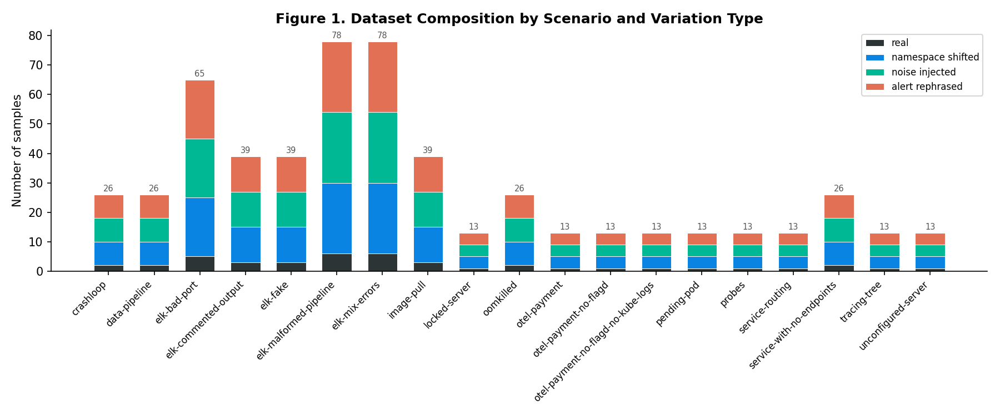

**Figure 1** shows the sample distribution across scenarios. The dataset exhibits inherent imbalance: ELK-related scenarios (elk-malformed-pipeline, elk-mix-errors) contribute 78 samples each, while single-alert scenarios (e.g., locked-server, probes) contribute 13. This reflects the natural heterogeneity of production incident types, where some failure modes manifest through multiple correlated alerts while others produce a single indicator.

### 2.1 Variation Types

Four variation types are present in the dataset:

| Type | Count | Description | Purpose |
|------|-------|-------------|---------|
| `real` | 43 | Original scenarios from ROMA, unmodified | Ground truth baseline |
| `namespace_shifted` | 172 | Namespaces, pod names, IPs, UUIDs, and timestamps deterministically remapped | Tests invariance to naming conventions |
| `noise_injected` | 172 | Healthy decoy pods and namespaces added to the MCP cache | Tests signal-to-noise discrimination |
| `alert_rephrased` | 172 | Alert text rewritten with varying levels of detail using templates | Tests robustness to alert format variation |

Each synthetic type was generated with 4 independent random seeds (42, 500, 800, 1200), producing distinct mutations per seed while preserving the underlying root cause.

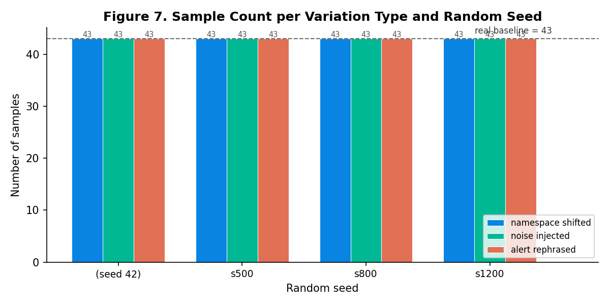

**Figure 7** confirms uniform sample counts (43) across all seed–variation combinations, as expected from the deterministic generation pipeline.

---

## 3. Root Cause Taxonomy

Alerts are categorized into 11 root cause families based on the nature of the underlying failure:

| Family | Base alerts | Samples | Description |
|--------|------------|---------|-------------|
| config_error | 21 | 273 | Logstash/ELK pipeline misconfigurations (syntax, port, output) |
| container_error | 4 | 52 | Invalid commands or broker queue issues causing CrashLoopBackOff |
| false_alarm | 3 | 39 | Alerts that do not correspond to a real failure |
| image_error | 3 | 39 | Invalid container image references (ImagePullBackOff) |
| service_failure | 3 | 39 | Payment service failures in OpenTelemetry demo |
| scheduling_error | 3 | 39 | Non-existing volumes or invalid node selectors |
| resource_limit | 2 | 26 | OOMKilled due to memory limit exceeded |
| lock_error | 1 | 13 | Server lock not released by previous job |
| performance | 1 | 13 | High response time degradation |
| probe_error | 1 | 13 | Misconfigured liveness/readiness probes |
| routing_error | 1 | 13 | Service selector mismatch preventing traffic routing |

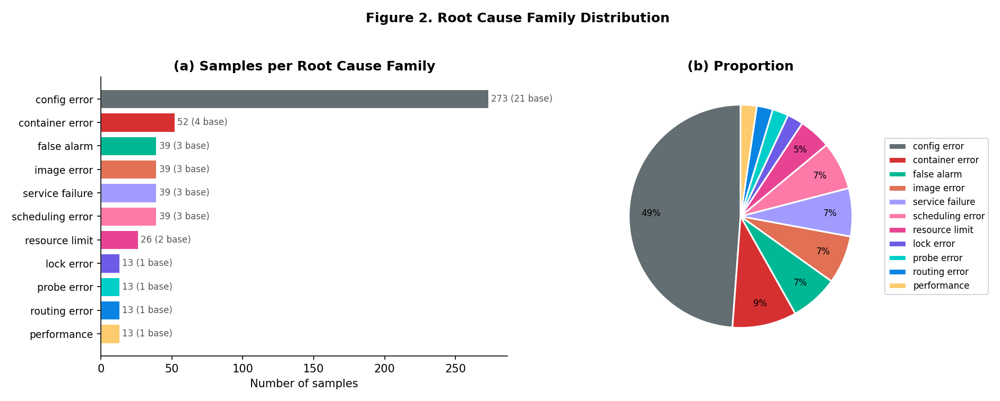

**Figure 2** shows the class distribution. `config_error` constitutes 48.8% of all samples (21 of 43 base alerts), reflecting the composition of the ROMA corpus. Five families contain only 1 base alert each, which limits the applicability of some evaluation strategies for those categories.

**Class imbalance metrics:**
- Imbalance ratio (largest / smallest family): **21.0×** (273 vs. 13 samples)
- Shannon entropy of the family distribution: **H = 2.606 bits** (normalized: **0.753**, where 1.0 = perfectly uniform across 11 classes)

This imbalance is representative of real-world incident distributions, where certain failure categories occur far more frequently than others.

---

## 4. Training Split Strategies

Four complementary split configurations are provided, each designed to measure a different dimension of agent generalization. All splits enforce a strict **no data leakage** constraint: all 13 variations of a given base alert are always assigned to the same partition.

### 4.1 Stratified Random Split (80/20)

**File:** `training_stratified.json`

A single train/test partition stratified by root cause family. The algorithm allocates at least one base alert per family to the test set when the family has 2+ members; singleton families remain in train.

| Partition | Samples | Base alerts | Ratio |
|-----------|---------|-------------|-------|
| Train | 442 | 34 | 79.1% |
| Test | 117 | 9 | 20.9% |

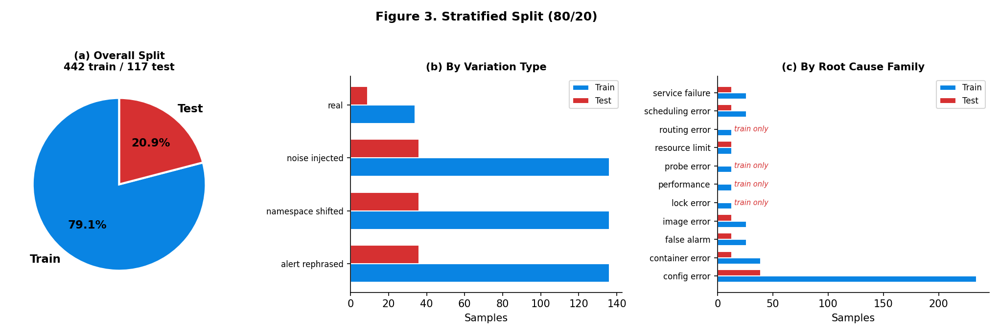

**Figure 3(a)** shows the global split ratio (79.1/20.9%, within 1 percentage point of the 80/20 target). **Figure 3(b)** shows that all four variation types maintain the same 20.9% test ratio, indicating that no variation type is over- or under-represented. **Figure 3(c)** shows that 7 of 11 root cause families are present in the test set. The remaining 4 families (`lock_error`, `performance`, `probe_error`, `routing_error`) are singletons assigned to train; evaluating on these requires leave-one-out or cross-validation approaches (see §4.3–4.4).

**When to use:** General-purpose training and evaluation. Appropriate when the goal is to measure overall RCA accuracy across a representative sample.

---

### 4.2 Leave-One-Variation-Out (LOVO)

**File:** `training_leave_variation_out.json` · **4 folds**

Each fold holds out all samples of one variation type (across all seeds). The agent is trained on three variation types and evaluated on the fourth.

| Held-out fold | Train | Test |
|---------------|-------|------|
| real | 516 | 43 |
| namespace_shifted | 387 | 172 |
| noise_injected | 387 | 172 |
| alert_rephrased | 387 | 172 |

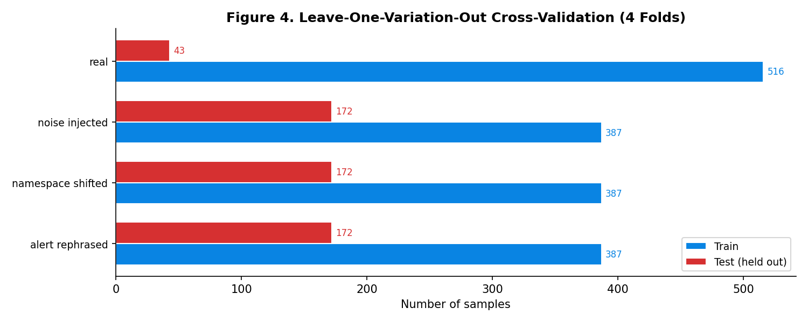

**Research question:** *Does the agent generalize to transformation types it has never encountered during training?*

The `real` fold has only 43 test samples (7.7% of the dataset), while synthetic folds have 172 (30.8%). This asymmetry reflects the dataset construction. The `hold_out_real` fold evaluates whether an agent trained exclusively on synthetic variations can still diagnose unmodified real alerts, which is relevant for validating synthetic augmentation strategies.

**When to use:** Validating that synthetic augmentation generalizes to real data, or that the agent is invariant to specific perturbation types.

---

### 4.3 Leave-One-Scenario-Out (LOSO)

**File:** `training_leave_scenario_out.json` · **19 folds**

Each fold holds out all alerts (and their variations) from one base scenario. This is the most granular cross-validation strategy.

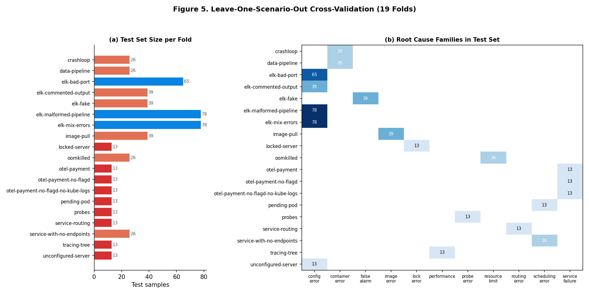

**Figure 5(a)** shows test set sizes ranging from 13 (single-alert scenarios) to 78 samples (elk-malformed-pipeline, elk-mix-errors). **Figure 5(b)** is a heatmap of root cause families present in each fold's test set. The diagonal structure indicates that:

- ELK scenarios exclusively test `config_error` and `false_alarm` families.
- Single-alert scenarios test exactly one family each.
- No fold simultaneously tests more than one family (because scenarios are thematically cohesive).

**Research question:** *Can the agent diagnose failures in an infrastructure scenario it has never observed?*

**When to use:** Measuring zero-shot generalization to novel infrastructure topologies. Particularly relevant for assessing whether learned diagnostic patterns transfer across different Kubernetes application stacks.

---

### 4.4 Leave-One-Family-Out (LOFO)

**File:** `training_leave_family_out.json` · **11 folds**

Each fold holds out all samples belonging to one root cause family. The agent must diagnose a category of failure entirely absent from its training data.

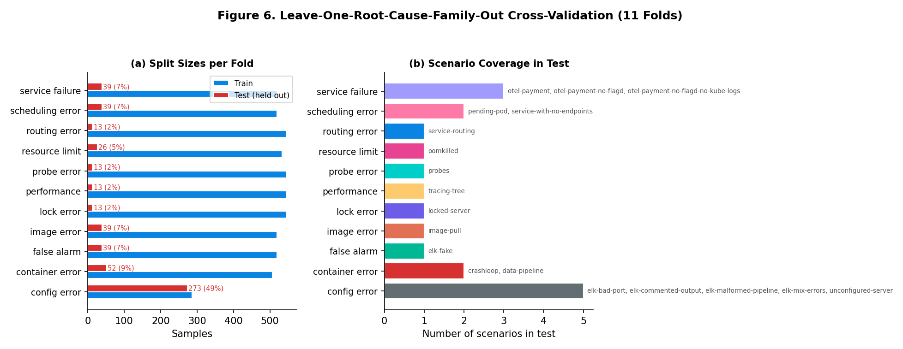

**Figure 6(a)** shows the variation in test set sizes: the `config_error` fold holds out 273 samples (49% of the dataset), while singleton families hold out 13 (2%). **Figure 6(b)** maps each family to its constituent scenarios.

| Held-out family | Test % | Scenarios held out |
|-----------------|--------|-------------------|
| config_error | 48.8% | elk-bad-port, elk-commented-output, elk-malformed-pipeline, elk-mix-errors, unconfigured-server |
| container_error | 9.3% | crashloop, data-pipeline |
| service_failure | 7.0% | otel-payment (3 variants) |
| scheduling_error | 7.0% | pending-pod, service-with-no-endpoints |
| false_alarm | 7.0% | elk-fake |
| image_error | 7.0% | image-pull |
| resource_limit | 4.7% | oomkilled |
| lock_error | 2.3% | locked-server |
| performance | 2.3% | tracing-tree |
| probe_error | 2.3% | probes |
| routing_error | 2.3% | service-routing |

**Research question:** *Can the agent perform zero-shot root cause categorization on failure types entirely absent from training?*

**When to use:** Evaluating whether the agent learns transferable diagnostic reasoning (e.g., log analysis patterns, Kubernetes state interpretation) rather than memorizing root cause templates.

---

## 5. Golden Entities for Automated Evaluation

Each scenario defines 3 **golden entities**: short strings that an LLM evaluator can use to automatically score an agent's root cause analysis output. Golden entities are compared against the agent's response text using **normalized Levenshtein similarity** with a threshold of **θ = 0.95**.

### 5.1 Selection Criteria

Entities were selected through a quantitative pipeline analyzing 19 base scenarios:

| Criterion | Metric | Coverage |
|-----------|--------|----------|
| Not in alert text | `entity ∉ alert_text` (case-insensitive) | **100%** (57/57) |
| In expected output | `entity ∈ expected_output` (≥ 2/3 per scenario) | **88%** (50/57) |
| Present in MCP data | `entity ∈ kubectl/logs/traces output` | **37%** (21/57) |
| Highly discriminative | `D = 1/(1+other_scenarios) ≥ 0.5` | **75%** (43/57) |

The 37% MCP presence rate is by design: **diagnostic synthesis entities** (E2, E3) represent conclusions the agent must *infer* from raw evidence, not terms it copies verbatim from tool outputs. Evidence entities (E1) have higher MCP presence.

### 5.2 Entity Taxonomy

Each scenario's 3 entities follow a consistent taxonomy:

| Type | Role | Example (crashloop) |
|------|------|-------------------|
| **E1** — Technical evidence | Exact error/value found via MCP tools | `unterminated quoted string` |
| **E2** — Diagnostic synthesis | Phrase proving the agent connected the dots | `invalid python3 command` |
| **E3** — Root cause identifier | Term identifying the nature of the problem | `nginx image` |

### 5.3 Levenshtein Viability Analysis

At θ = 0.95, the maximum allowed edit distance is `len(entity) × 0.05`. This constrains viable entity lengths:

| Length range | Max edits | Match type | Count |
|-------------|-----------|------------|-------|
| ≥ 20 chars | ≥ 1.0 | 1+ typo tolerance | 8 (14%) |
| 10–19 chars | 0.5–0.95 | Near-exact match | 45 (79%) |
| < 10 chars | < 0.5 | Exact match required | 4 (7%) |

**Median entity length: 14 characters. Range: 9–28.**

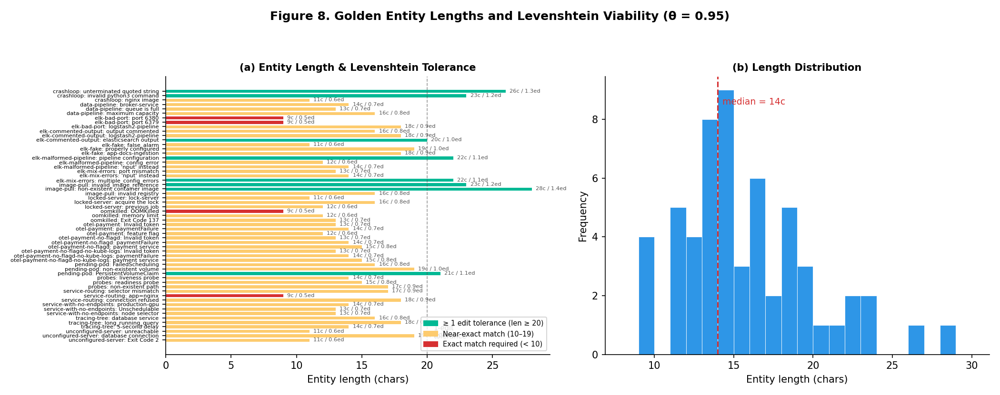

**Figure 8(a)** shows all 57 entities color-coded by Levenshtein tolerance class. Most entities (79%) fall in the 10–19 char range, demanding near-exact reproduction. The 8 entities ≥ 20 chars (e.g., `non-existent container image` at 28c) allow minor variations. **Figure 8(b)** confirms the length distribution clusters around the 12–18 char range.

### 5.4 Discriminative Power

An entity's discriminative power measures how unique it is to its scenario, defined as D = 1/(1 + N) where N is the number of other scenarios whose MCP data contains the entity.

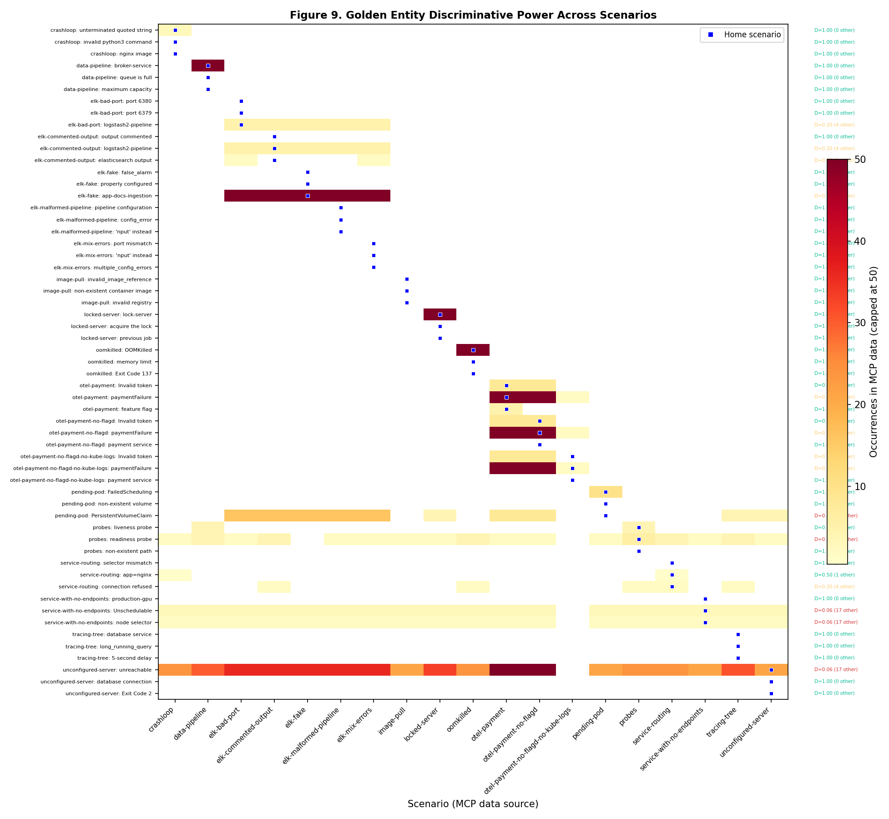

**Figure 9** is a cross-scenario heatmap showing MCP occurrences. Key observations:

- **75% of entities (43/57) have D ≥ 0.5** (appear in at most 1 other scenario's MCP data), confirming high specificity.
- Generic infrastructure terms (`unreachable`, `Unschedulable`, `PersistentVolumeClaim`) have low D because they appear across many scenarios' kubectl output. However, they remain valid because the *combination* of 3 entities is unique per scenario.
- Home-scenario markers (blue squares) show that entities with low MCP frequency in their own scenario are diagnostic conclusions, not raw evidence.

### 5.5 MCP Evidence Frequency

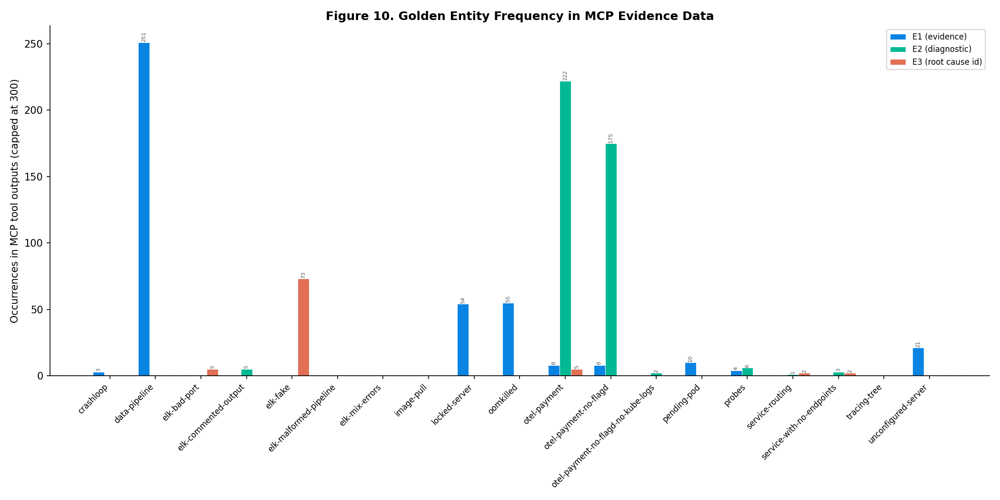

**Figure 10** shows three entity frequency profiles:

1. **High-frequency evidence** (>50 MCP occurrences): `broker-service` (251×), `paymentFailure` (222×), `OOMKilled` (55×). These terms permeate the MCP data and a thorough agent will inevitably encounter them.
2. **Low-frequency signals** (1–20 MCP occurrences): `Invalid token` (8×), `logstash2-pipeline` (5×), `app=nginx` (1×). These require targeted investigation with the right MCP tools.
3. **Inference-only entities** (0 MCP occurrences): `queue is full`, `selector mismatch`, `false_alarm`. These don't appear literally in MCP data — the agent must synthesize them from evidence patterns, testing genuine diagnostic reasoning.

### 5.6 Taxonomy and Quality Summary

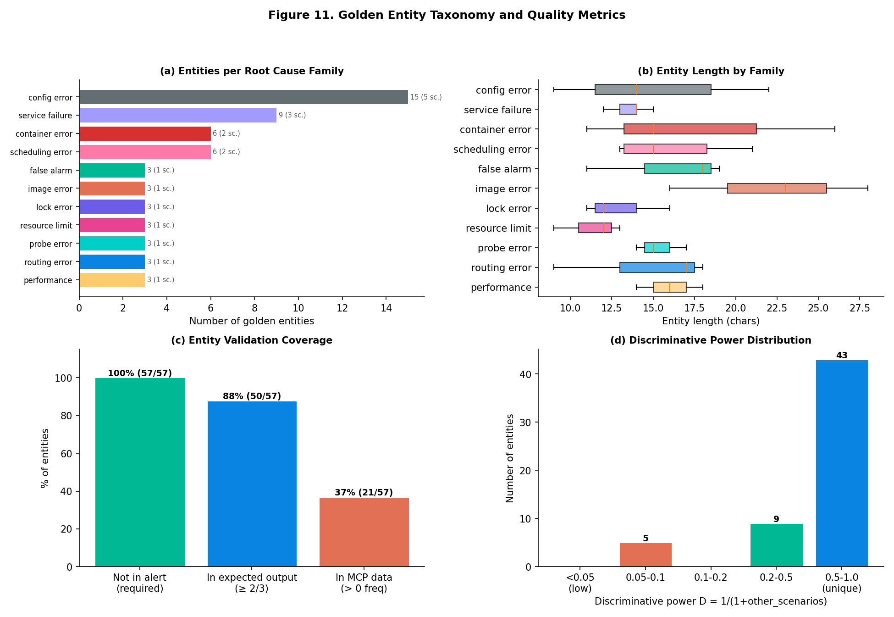

**Figure 11** provides a consolidated quality view:

- **(a)** Entity distribution follows root cause family sizes: `config_error` (5 scenarios) contributes 15 entities; singleton families contribute 3 each.
- **(b)** Entity length varies by family: `image_error` entities are longest (median ~22c, highest Levenshtein tolerance), while `lock_error` and `resource_limit` are shorter (11–13c).
- **(c)** All 57 entities satisfy the core constraint (not in alert). 88% appear in the expected output text.
- **(d)** 43 of 57 entities (75%) are unique or near-unique (D ≥ 0.5) to their scenario. Only 5 entities have low discriminative power (D < 0.1), and these are generic Kubernetes terms compensated by their co-occurrence with highly specific partners.

### 5.7 Complete Golden Entity Table

| Scenario | E1 (Evidence) | E2 (Diagnostic) | E3 (Root Cause) |
|----------|--------------|-----------------|-----------------|
| crashloop | `unterminated quoted string` | `invalid python3 command` | `nginx image` |
| data-pipeline | `broker-service` | `queue is full` | `maximum capacity` |
| elk-bad-port | `port 6380` | `port 6379` | `logstash2-pipeline` |
| elk-commented-output | `output commented` | `logstash2-pipeline` | `elasticsearch output` |
| elk-fake | `false_alarm` | `properly configured` | `app-docs-ingestion` |
| elk-malformed-pipeline | `pipeline configuration` | `config_error` | `'nput' instead` |
| elk-mix-errors | `port mismatch` | `'nput' instead` | `multiple_config_errors` |
| image-pull | `invalid_image_reference` | `non-existent container image` | `invalid registry` |
| locked-server | `lock-server` | `acquire the lock` | `previous job` |
| oomkilled | `OOMKilled` | `memory limit` | `Exit Code 137` |
| otel-payment | `Invalid token` | `paymentFailure` | `feature flag` |
| otel-payment-no-flagd | `Invalid token` | `paymentFailure` | `payment service` |
| otel-payment-no-flagd-no-kube-logs | `Invalid token` | `paymentFailure` | `payment service` |
| pending-pod | `FailedScheduling` | `non-existent volume` | `PersistentVolumeClaim` |
| probes | `liveness probe` | `readiness probe` | `non-existent path` |
| service-routing | `selector mismatch` | `app=nginx` | `connection refused` |
| service-with-no-endpoints | `production-gpu` | `Unschedulable` | `node selector` |
| tracing-tree | `database service` | `long_running_query` | `5-second delay` |
| unconfigured-server | `unreachable` | `database connection` | `Exit Code 2` |

### 5.8 Evaluation Protocol

To evaluate an agent's response using golden entities:

```python
from Levenshtein import ratio  # python-Levenshtein

def score_response(response_text: str, golden_entities: list[str], threshold: float = 0.95) -> dict:
    hits = 0
    for entity in golden_entities:
        # Sliding window fuzzy substring search
        best_ratio = 0.0
        window = len(entity)
        for i in range(len(response_text) - window + 1):
            r = ratio(entity.lower(), response_text[i:i+window].lower())
            best_ratio = max(best_ratio, r)
            if best_ratio >= threshold:
                break
        if best_ratio >= threshold:
            hits += 1
    return {"hits": hits, "total": len(golden_entities), "recall": hits / len(golden_entities)}
```

**Scoring interpretation:**
- **3/3 hits** — Agent fully identified the root cause with supporting evidence.
- **2/3 hits** — Partial diagnosis; agent found the root cause but missed specifics.
- **1/3 or 0/3** — Agent failed to identify the root cause.

---

## 6. Methodological Considerations

### 6.1 Data Leakage Prevention

All variations of a base alert share the same root cause, infrastructure topology, and MCP response structure. Placing different variations of the same alert in both train and test would allow an agent to achieve high test accuracy by memorizing surface patterns rather than learning diagnostic reasoning. Therefore, **all 13 variations of each base alert are always assigned to the same partition**.

### 6.2 Class Imbalance

The 21× imbalance ratio between `config_error` (273 samples) and singleton families (13 samples) has practical implications:

- **Accuracy metrics are misleading.** An agent that only diagnoses `config_error` achieves 48.8% accuracy. Evaluation should use **macro-averaged F1** or **per-family recall** to give equal weight to all failure types.
- **LOFO `config_error` fold is special.** Holding out 49% of the dataset tests whether the agent can function without its most common training signal. Conversely, singleton folds test with minimal evidence.

### 6.3 Synthetic Variation Validity

Synthetic variations are designed to preserve the diagnostic challenge while altering surface features:

- **namespace_shifted** ensures the root cause is independent of arbitrary naming.
- **noise_injected** verifies the agent can distinguish relevant signals from benign cluster activity.
- **alert_rephrased** tests whether the agent over-relies on specific alert phrasing versus the underlying MCP evidence.

The ground truth (`expected_output`) is adapted consistently with each variation: namespace-shifted variants update entity names in the root cause description, while alert-rephrased variants preserve the original root cause verbatim.

### 6.4 Limitations

1. **Domain scope.** All scenarios involve Kubernetes workloads. Generalization to non-containerized infrastructure is not assessed.
2. **Static MCP responses.** The mock server returns pre-recorded responses. Agents cannot perform iterative exploration beyond what was anticipated during cache generation.
3. **ELK dominance.** The config_error family accounts for nearly half the dataset, reflecting the ROMA corpus composition. Results may be biased toward ELK diagnostic patterns.
4. **Singleton families.** Five root cause families have only 1 base alert (13 samples). Statistical conclusions about these families have high variance.

---

## 7. Reproduction

All figures and splits can be regenerated deterministically:

```bash
# Generate all synthetic variations
for type in namespace_shifted noise_injected alert_rephrased; do
  uv run python -m event_system.generate_variations --type $type --all
  for seed in 500 800 1200; do
    uv run python -m event_system.generate_variations --type $type --all --seed $seed --suffix s$seed
  done
done

# Generate training splits
uv run python -m event_system.build_training_split

# Generate golden entities
uv run python -m event_system.build_golden_entities

# Generate documentation figures (Fig. 1–11)
uv run python docs/generate_figures.py
```

All operations are deterministic given the same random seeds and source data.
