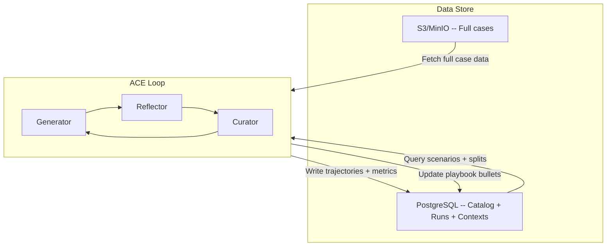

# Architecture

## Layered architecture

The application follows a layered architecture where each layer has a single responsibility:

```
HTTP Request
    |
    v
API Layer (src/app/api/)                --> Receives requests, validates input
    |
    v
Service Layer (src/app/services/)       --> Business logic, orchestration
    |
    v
Repository Layer (src/app/repositories/)  --> Database access
    |
    v
Database
```

**Rules:**

- Each layer only talks to the layer directly below it.
- Business logic never goes in the API layer.
- Database queries never go in the service layer.

## ACE components

ACE (Agentic Context Engineering) treats contexts as evolving playbooks that accumulate, refine, and organize strategies through three components:

- **Generator** -- Creates reasoning trajectories and problem-solving traces for new queries, surfacing both effective tactics and observed pitfalls.
- **Reflector** -- Critiques outputs by comparing successful and unsuccessful trajectories, distilling domain-specific insights.
- **Curator** -- Maintains a structured context store with incremental updates that preserve knowledge and avoid redundancy.

## Data flow



### How it connects

1. **cases schema** stores the scenario catalog (559 scenarios) and train/test split assignments. This is seeded automatically from DVC/S3 on deployment.
2. **S3/MinIO** stores the full case data (input alerts, expected output, fixtures, ground truth). Jobs query the catalog in PostgreSQL to know _which_ cases to process, then download the actual data from S3.
3. **runs schema** stores execution results: which scenario was run, with which model and context version, the step-by-step trajectory, and evaluation metrics.
4. **contexts schema** stores the evolving playbook: versioned context snapshots containing insight bullets with pgvector embeddings for semantic deduplication and retrieval.

The ACE loop runs iteratively: the Generator processes scenarios using the current context, the Reflector analyzes results to extract insights, and the Curator updates the context store. Each iteration improves the playbook, which feeds back into the next generation cycle.
